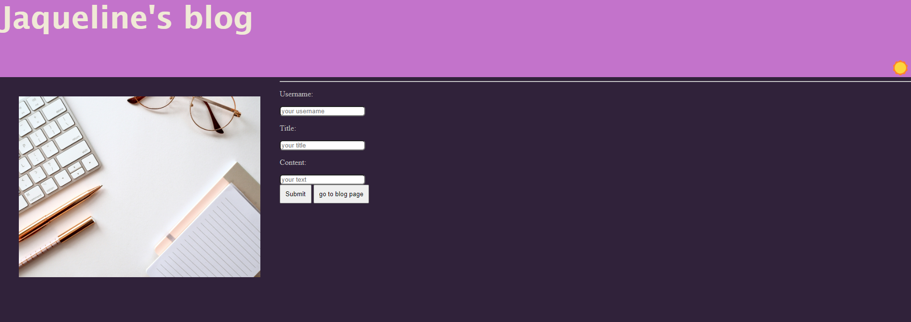
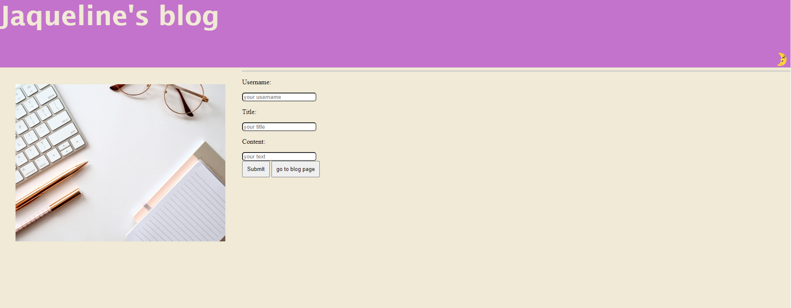
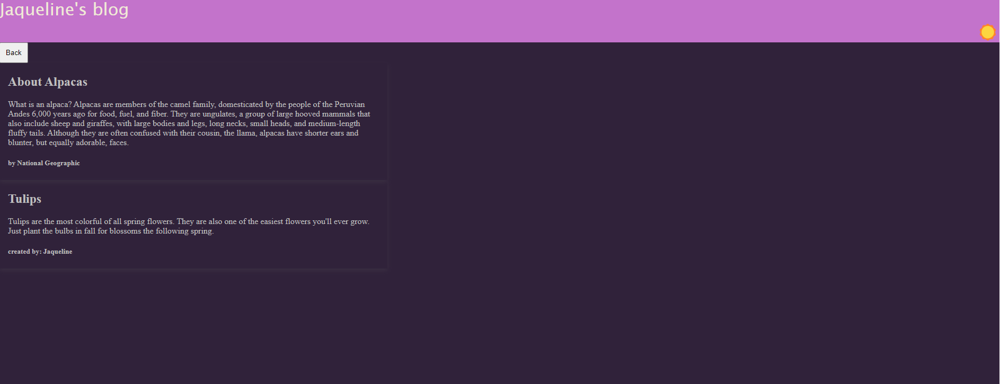
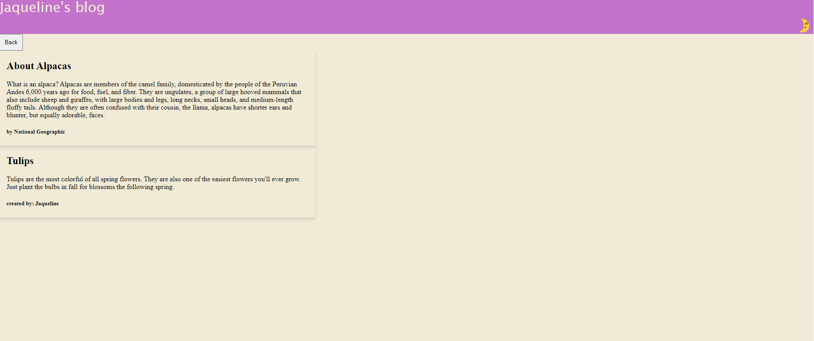

# Jaqueline's Blog Project

## Description

## Usage
In the 'nav' bar we have a icon ☀️ to see the page in light mode and 🌛 to see the dark mode, when the user insert their username, title ,content and click submit , they'll be able to post in the blog page.
theres footer with my portfolio link, my email and github page.

## Credits

I had some help from the lectures, xpert learning, w3 schools, MDN web and google.

## Deployed page
https://jaquelineesteves.github.io/my-blog/

## Repository:
https://github.com/jaquelineesteves/my-blog
